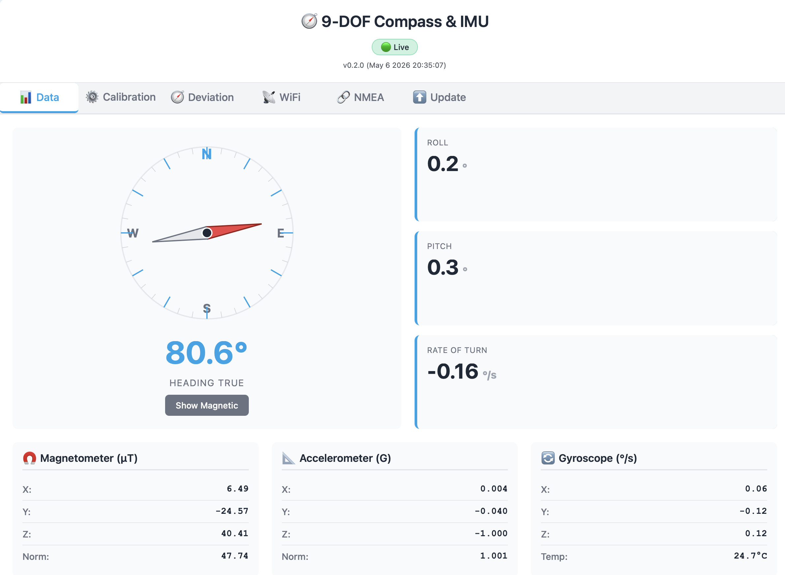
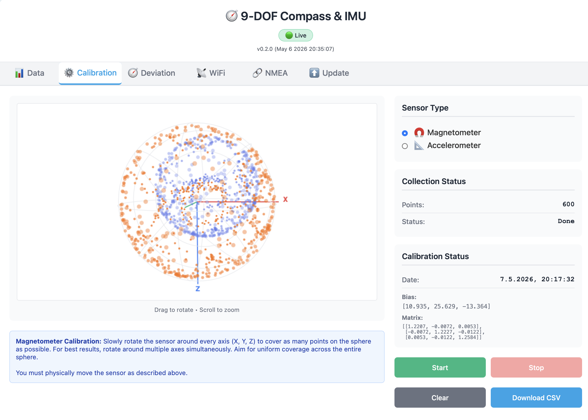
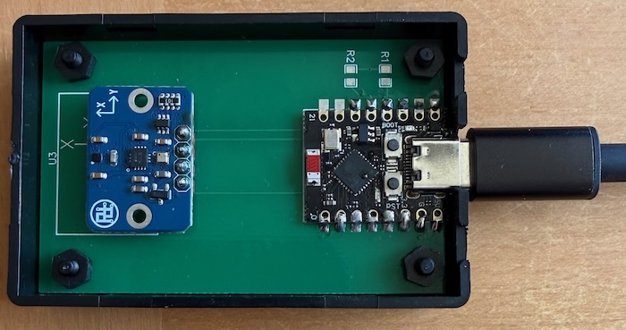

# ESP32-C3 9-DOF Marine Compass

A tilt-compensated electronic compass for sailboats, built on an ESP32-C3 with a Bosch BMM350 magnetometer, BMI323 IMU, and BMP390 barometer. Publishes NMEA 0183 sentences over WiFi (TCP/UDP) and USB serial, and is configured entirely through a web interface.

The BMM350 sensor is based on TMR (tunnel magnetoresistance) technology instead of Hall-effect promises lower noise and higher sensitivity compared to earlier Bosch sensors.

The project is based on PlatformIO using the Arduino libraries. The code can be compiled with PlatformIO and uploaded to an ESP32-C3 (probably other ESP32 as well, but I did not try) connected to the sensors via I²C. All configuration can be done using the web interface.

<p align="center">
  
  &nbsp;&nbsp;
  
</p>

## Features

- **Tilt-compensated heading** via magnetometer, accelerometer, and gyroscope fusion using the Madgwick algorithm with 200Hz.
- **Web interface based calibration** — for accelerometer, magnetometer (hard/soft-iron), gyro bias and mounting correction.
- **Magnetic deviation correction** can be done by manually entering deviation table or correcting against COG from connected GPS source
- **WMM-2025 declination correction** for true-north correction, updated automatically from GPS lat/lon/date.
- **NMEA 0183 output** over TCP server, TCP client, UDP broadcast, and USB serial — choose any combination.
- **Sentences:** `$IIHDM` (magnetic heading), `$IIHDT` (true heading, optional), `$IIROT` (rate of turn), `$IIXDR,A,...,ROLL`, `$IIXDR,A,...,PITCH`, `$WIXDR,P,...,Barometer`.
- **Configurable update rate** (1Hz to 20Hz).
- **OTA firmware updates**
- **Web interface** for live data, calibration, WiFi configuration, NMEA setup, and OTA firmware updates. 
- **Dual-mode WiFi** — connects to your boat's network if configured, otherwise serves its own AP for setup.

## Hardware

| Component | Notes |
|---|---|
| ESP32-C3 | Other ESP32 variants can be used with a `platformio.ini` board change. |
| Bosch BMM350 | I²C magnetometer |
| Bosch BMI323 (or BMI3xx) | I²C 6-axis IMU |
| Bosch BMP390 | I²C pressure sensor (optional but recommended) |

I have used a nice [breakout board from RTrobot](https://de.aliexpress.com/item/1005004252794090.html) that includes all sensors.

If you use above board and the ESP32-C3 supermini (search Aliexpress), you can use the PCB in the pcb folder for assembly. Otherwise a simple I2C cabel connection will do as well.



All three sensors share the I²C bus at 400 kHz. Wire `SDA`/`SCL` to the ESP32-C3 default pins, plus `3V3` and `GND`. 

A GPS receiver feeding NMEA `RMC`/`VTG` over TCP, UDP, or USB is recommended — without it, deviation auto-calibration and WMM declination updates won't run, but the compass itself still works.

## Build & Flash

This is a [PlatformIO](https://platformio.org) project.

Use the VS Code PlatformIO plugin to build it or use the command line:

```bash
# Build and flash
pio run -t upload 
```
## First-Time Setup

1. Power the device via USB. On first boot it has no saved WiFi credentials and starts an access point:
   - **SSID:** `ESP32-Compass`
   - **Password:** `compass123`
2. Connect a phone or laptop to that network.
3. Open `http://192.168.4.1` (or `http://esp32-compass.local` if your client supports mDNS).
4. Go to the **WiFi** tab and enter your boat's WiFi credentials. The device will reboot, join the network, and remain reachable at `esp32-compass.local`.
5. Change the AP password in the **WiFi** tab — it's printed on the serial console at boot for recovery.
6. Go the the NMEA tab and configure the NMEA0183 output channel.
7. Go to the Calibration tab and perform a accelerometer and magnetometer calibration.

## Web Interface

| Tab | Purpose |
|---|---|
| **Data** | Live compass rose, heading (true/magnetic toggle), roll, pitch, rate of turn, raw sensor readings. |
| **Calibration** | Accelerometer and magnetometer calibration via 3D ellipsoid-fit including visualization.|
| **Deviation** | Deviation table entry or GPS based recording. |
| **WiFi** | Station credentials, AP password, hostname (also drives mDNS name). |
| **NMEA** | Select which sentences are emitted (`HDM`/`HDT`), update rate, and which transports are active (serial, TCP server, TCP client, UDP). Configure GPS input source. |
| **Update** | OTA firmware upload (`.bin`). |

## NMEA Output

Default ports — all configurable via the **NMEA** tab:

| Transport | Default | Notes |
|---|---|---|
| Serial (USB CDC) | 115200 baud | Same channel as the log console |
| TCP server | port `2000` | Fixed; up to 5 simultaneous clients |
| TCP client | | Connects out to a configured listener |
| UDP broadcast | port `10110` | Standard NMEA-over-UDP port |

Multiple transports can run concurrently. The same configurable transports also accept incoming NMEA — typically GPS sentences (`RMC`, `VTG`, `GGA`) — used to drive deviation auto-calibration and WMM declination.

## Calibration Workflow

The compass needs accelerometer and magnetometer calibration before it produces accurate output. The web UI walks through each.

1. **Accelerometer** — Hold the sensor in 6 different orientations. 
3. **Magnetometer (hard/soft-iron)** — Slowly rotate the sensor around every axis (X, Y, Z) to cover as many points on the sphere as possible. For best results, rotate around multiple axes simultaneously. Aim for uniform coverage across the entire sphere. The bias and matrix are computed via streaming least-squares ellipsoid fit.
This corrects for all components that you rotate together with the magnetometer (elctronics, housing, cables, etc.). It does not correct for magnetic fields that arise from other sources on your boat that have not been rotated together with the magnetometer. 
4. **Deviation table** *(automatic, optional)* — This might be necessary to compensate for magnetic materials on your boat that are impossible to rotate with the magnetometer (e.g. keel).There is an option to either manually enter a deviation table or record it relative to GPS heading. For recording the deviation with the COG as reference you need a NMEA0183 GPS source connected as input to the sensor (e.g. using wifi).
Motor the boat steadily on each heading shown in the compass rose. Sequence does not matter. There should be no current or wind induced drift since deviation is calculated from GPS COG vs compass heading! Data is collected when SOG ≥ 3 kts and compass heading is within 5° of the target heading. Each segment turns yellow when collecting and green when ~60 seconds of data is collected. Even when a segment is green, you can continue to collect more data to improve accuracy.

All calibrations are timestamped (using GPS time when available) and persist across reboots and firmware updates.

The firmware does NOT do any periodic recalibration in the background. This is on purpose to make the behaviour predictable. If you notice that the calibration is not valid anymore, repeat the calibration.

## Library dependency

The sensor stack lives in a separate library package, `BMM350_BMI3XY_compass_lib_pack` — this bundles the Bosch SensorAPIs, the Fusion AHRS sources, the magneto ellipsoid-fit calibration, and the higher-level wrapper classes.

The purpose of this is that `BMM350_BMI3XY_compass_lib_pack` can be easier used in other projects. This code is not ESP32 dependent and can run also on other Arduino boards with e.g. the SAMD21 microcontroller.

## Security

Please review these security considerations before deploying on your boat:

- **Default Access Point Password:** The device starts with a default AP password (`compass123`) on first boot. Change this immediately in the **WiFi** tab of the web interface.
- **Unprotected Web Interface:** The web interface is not password-protected. Anyone who can connect to the device's WiFi network can:
  - View live sensor data
  - Modify WiFi credentials and calibration settings
  - Perform firmware updates
  - Change NMEA output configuration
- **Network Security:** Only deploy on trusted networks. Do not expose the device to open or untrusted networks.

## License

This project is released under the MIT License — see [LICENSE.md](LICENSE.md).

The bundled sensor library `BMM350_BMI3XY_compass_lib_pack` includes third-party components under their respective licenses.

## Acknowledgments

- Bosch Sensortec for the open SensorAPI source.
- Sebastian Madgwick / xio-Technologies for the Fusion library.
- [James Remington](https://github.com/jremington/ICM_20948-AHRS) for the magneto1_4 code
